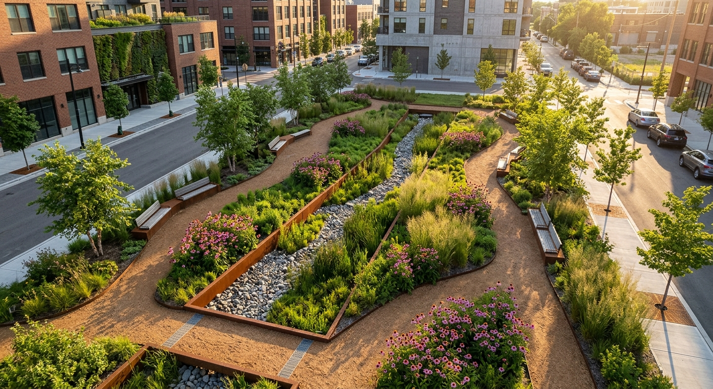
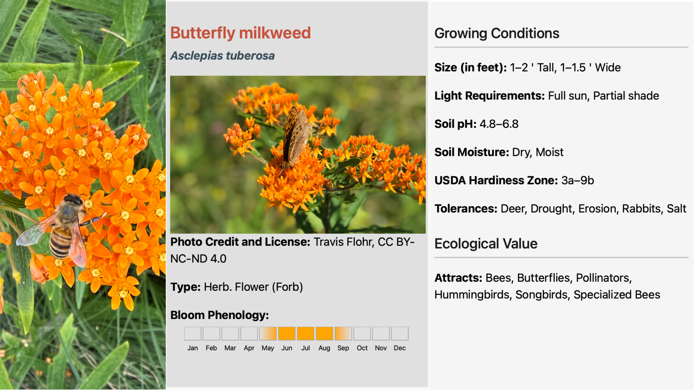

```{r}
#| label: setup
#| include: false
current_year <- format(Sys.Date(), "%Y")
```


```{=html}
<!-- Slider -->
<div id="accessibleCarousel" class="carousel slide" data-bs-ride="carousel">
  
  <!-- Slide Indicators (Optional) -->
  <div class="carousel-indicators">
    <button type="button" data-bs-target="#accessibleCarousel" data-bs-slide-to="0" class="active" aria-current="true" aria-label="Slide 1"></button>
    <button type="button" data-bs-target="#accessibleCarousel" data-bs-slide-to="1" aria-label="Slide 2"></button>
    <button type="button" data-bs-target="#accessibleCarousel" data-bs-slide-to="2" aria-label="Slide 3"></button>
  </div>
  
  <!-- Carousel Slides -->
  <div class="carousel-inner">
    
    <!-- Slide 1 -->
    <div class="carousel-item active">
      <!-- 1. Alt text added directly inside the img tag for screen readers -->
      
      
      <!-- 2. Caption shifted below the image using padding (pt-3) and styled with black text (text-dark) -->
      <div class="text-start text-dark pt-3">
        <p class="mb-0">Bees drinking water. Source: Donna Becker</p>
      </div>
    </div>
    
    <!-- Slide 2 -->
    <div class="carousel-item">
      

      <div class="text-start text-dark pt-3">
        <p class="mb-0">Ecologically performant pocket park. Source: Travis Flohr/Gemini</p>
      </div>
    </div>

        <!-- Slide 3 -->
    <div class="carousel-item">
      

      <div class="text-start text-dark pt-3">
        <p class="mb-0">Foraging bee on a Butterfly Milkweed and a Butterfly Milkweed plant fact card. Source: Travis Flohr</p>
      </div>
    </div>
    
  </div>
  
  <!-- Accessibility-friendly Side Navigation Controls -->
  <!-- High-Contrast Left Button -->
  <button class="carousel-control-prev" type="button" data-bs-target="#accessibleCarousel" data-bs-slide="prev" style="width: 5%;">
    <span class="carousel-control-prev-icon" aria-hidden="true" 
          style="filter: invert(1); background-color: rgba(0, 0, 0, 0.15); padding: 20px; border-radius: 50%;"></span>
    <span class="visually-hidden">Previous Slide</span>
  </button>
  
  <!-- High-Contrast Right Button -->
  <button class="carousel-control-next" type="button" data-bs-target="#accessibleCarousel" data-bs-slide="next" style="width: 5%;">
    <span class="carousel-control-next-icon" aria-hidden="true" 
          style="filter: invert(1); background-color: rgba(0, 0, 0, 0.15); padding: 20px; border-radius: 50%;"></span>
    <span class="visually-hidden">Next Slide</span>
  </button>
  
</div>
```

# Syllabus {.unnumbered}

## Course Information

### Meeting Times

Tuesday and Thursday, [2:30-5:30 PM]{style="background-color: yellow;"}

### Location(s)

**Classroom**: 4th Floor Studio.
<br>

{fig-alt="An aerial map of a campus section of Penn State showing Curtin Road to the north and Shortlidge Road to the east. The map uses a selective color effect: the surrounding buildings and roads are in grayscale, while a central horizontal swath of landscaping is highlighted in full color. This green corridor features large lawns, mature trees, and curved walkways, and is situated south of the Weaver, Armsby, and Arts Cottage buildings, and north of the Frear North, Althouse Laboratory, and Chemical and Biomedical Engineering buildings."}


```{r class room map}
#| warning: false
#| echo: false
#| message: false

# call and run script for class room building location
# source("boilerplate/00_classroom_map.R")

# map_classroom
```

### Faculty

Travis Flohr, Ph.D., [tlf159\@psu.edu](mailto:tlf159@psu.edu), 419 SFB, office hours by appointment.

### Credits

5-credits

### Course Costs
I have tried to keep course costs to a minimum. Feel free to leverage your existing supplies (e.g., pens, pencils, erasers, and pencil sharpeners). Still, @tbl-course_costs is our best estimate of course costs based on past course experiences. You may use markers or pens other than those listed below; the key is being able to produce the work that is required of you. However, note that exact costs may vary depending on the extent of your plant lists when printing for review. You may use markers or pens than other from those listed below; the key is to quickly create conceptual drawings with three to four distinctly different line weights. 

| Materials and Supplies                          | Total Costs |
|:------------------------------------------------|-------:|
| *Materials and Supplies*                          |        |
| Field Journal                                    | $25.00 |
| Fine Liner Technical Pens or Sharpies            | $15.00 |
| Graphite Pencil Set, with multiple (3+) hardness's| $10.00 |
| Pencil Sharpener                                  | $2.00  |
| 1 roll of 24" trace                               | $20.00 |
| *Printing*                                        |        |
| 11” x 17” (Tabloid) Black and White Plant Lists, 20 sheets (single-sided) * $0.17 | $3.40  |
| 24” x 26” (Arch D) Black and White Base Maps, 2 sheets (single-sided) * $18.00    | $36.00 |
| ***Total Costs***                                                          | ***$111.40*** |

: Estimated course costs. {#tbl-course_costs}

** Disclaimer. Prices are as accurate as those provided in the summer of Published in `{r} current_year`.

Please feel free to express yourself artistically with supplies other than those listed above.


# Text to integrate below

LARCH 414: Planting Design for Ecological Performance – Course Proposal

Spring Semester to coincide with ongoing Arboretum Planning and OPP schedules.
Course Description
LARCH 414: Planting Design for Ecological Performance is an advanced studio focused on integrating planting design and methods to achieve net biodiversity gain in institutional and public landscapes. The studio is aligned with Penn State’s Sustainable Landscape Implementation Plan (SLIP). It parallels the American Society of Landscape Architects’ Climate & Biodiversity Action Plan (2026–2030), emphasizing biodiversity, climate resilience, and measurable landscape performance. 
The studio prioritizes plant–insect–pollinator interactions, ecological function, and long-term landscape stewardship. The studio places equal emphasis on implementation, visualization, and professional communication to ensure ecological design intent is accessible to institutional clients and non-specialist stakeholders. Students will work with Penn State’s Office of Physical Plant to create designs for SLIP donor fundraising that can be implemented in the future and engage with content experts at Penn State’s Arboretum, Center for Pollinator Research, Huck Institute, and Landscape Contracting.
Course Justification
LARCH 414 addresses emerging professional expectations for performance-based, ecologically grounded landscape architecture practice. ASLA’s Climate & Biodiversity Action Plan (2026–2030) identifies biodiversity protection, restoration, and measurable outcomes—such as net biodiversity gain—as core professional responsibilities. This studio equips students with the skills needed to meet these expectations while reinforcing Penn State’s commitment to sustainable, biodiverse campus landscapes.
The course strengthens alignment with LAAB accreditation requirements, particularly in planting design, ecological systems, technical documentation, and professional communication. By integrating real-world campus conditions with professional standards, the course prepares students for contemporary practice.
Studio Learning Outcomes
• Design planting systems that achieve net biodiversity gain.
• Integrate plant–insect–pollinator interactions into planting design.
• Apply planting methods that ensure long-term landscape performance.
• Evaluate and communicate landscape performance outcomes.
• Produce clear, persuasive client-facing graphics and narratives.
LAAB Accreditation Alignment
The studio supports LAAB learning outcomes related to natural and cultural systems, plant materials, technical skills, professional communication, and contemporary practice issues, with emphasis on ecological performance and planting implementation.
Technology and Visualization Skills
Students will gain proficiency in:
• GIS for ecological and spatial analysis
• AutoCAD for planting plans and technical documentation
• Rhino for three-dimensional modeling
• Twinmotion for real-time rendering and visualization
• AI image generation tools for conceptual visualization and early design communication

